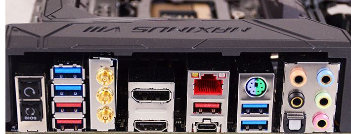
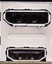
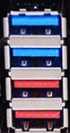
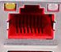
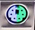
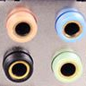

# Conectores externos de una placa base

Los **conectores externos** de una placa base son los puertos que se encuentran en el panel trasero del ordenador y permiten **conectar dispositivos externos**, como el teclado, ratón, monitor, USB, red...Estos conectores facilitan la comunicación entre la placa base y los periféricos para que el equipo funcione correctamente.
En la imagen se muestran un **total** de **17 puertos**, 7 USB, 2 HDMI,USB-C 1, 5 JACK,1 PS/2 y 1 LAN.

    **Conexión digital que transmite audio y video de alta calidad a través de un único cable**

    **Puerto estándar de conexión que permite conectar dispositivos electrónicos**

    **Puerto de red que permite la conexión de un equipo a una Red de Área Local (LAN) mediante un cable Ethernet**

    **Puerto ps/2 que se utilizaba tradicionalmente para conectar teclados y ratones al ordenador**

    **Puerto jack que permite conectar varios dispositivos al ordenador**
